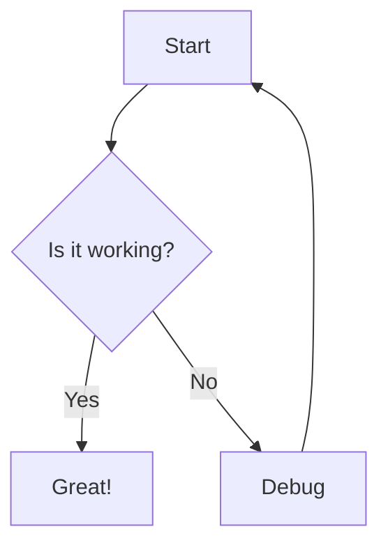

# Literate Programming in the Age of LLMs

- HN: [48691666](https://news.ycombinator.com/item?id=48691666)
- Source: [github.com](https://github.com/benatfroemming/explicode)
- Score: 2
- Comments: 1
- Posted: 2026-06-26T20:36:52Z

## Translation

タイトル: LLM 時代のリテラシー プログラミング
記事のタイトル: GitHub - benatfroemming/explicode: 新しい方法でコードを文書化する · GitHub
説明: 新しい方法でコードを文書化します。 GitHub でアカウントを作成して、benatfroemming/explicode の開発に貢献してください。

記事本文:
GitHub - benatfroemming/explicode: 新しい方法でコードを文書化する · GitHub
コンテンツにスキップ
ナビゲーションメニュー
サインイン
外観設定
プラットフォーム AI コード作成 GitHub Copilot AI を使用してより良いコードを作成する
GitHub Copilot アプリ エージェントが発行からマージまで直接担当
MCP レジストリ 新しい外部ツールの統合
開発者のワークフロー アクション あらゆるワークフローを自動化します
コードスペース インスタント開発環境
コードレビュー コードの変更を管理する
アプリケーションセキュリティ GitHub Advanced Security 脆弱性を見つけて修正する
コードのセキュリティ 構築時にコードを保護する
機密保護 漏洩が始まる前に阻止
企業規模別のソリューション
タイプごとに詳しく見る お客様の事例
サポートとサービスのドキュメント
オープンソース コミュニティ GitHub スポンサー オープンソース開発者に資金を提供する
エンタープライズ エンタープライズ ソリューション エンタープライズ プラットフォーム AI を活用した開発者プラットフォーム
利用可能なアドオン GitHub Advanced Security エンタープライズ グレードのセキュリティ機能
Copilot for Business エンタープライズ グレードの AI 機能
プレミアム サポート エンタープライズ レベルの 24 時間年中無休のサポート
検索またはジャンプ...
コード、リポジトリ、ユーザー、問題、プル リクエストを検索します...
クリア
検索構文のヒント
フィードバックを提供する
-->
私たちはフィードバックをすべて読み、ご意見を真摯に受け止めます。
保存された検索を使用して結果をより迅速にフィルタリングします
-->
名前
クエリ
利用可能なすべての修飾子を確認するには、ドキュメントを参照してください。
外観設定
フォーカスをリセットする
別のタブまたはウィンドウでサインインしました。リロードしてセッションを更新します。
別のタブまたはウィンドウでサインアウトしました。リロードしてセッションを更新します。
別のタブまたはウィンドウでアカウントを切り替えました。リロードしてセッションを更新します。
アラートを閉じる
{{ メッセージ }}
ベナトフロミング
/
エクスプリコード
公共
通知
通知設定を変更するにはサインインする必要があります
追加のナビゲーション オプション
コード
main ブランチ タグ ファイルに移動

コード 「その他のアクション」メニューを開く フォルダーとファイル
40 コミット 40 コミット .vscode .vscode メディア メディア スキル/ explicode スキル/ explicode src src webview-ui webview-ui .gitignore .gitignore .vscode-test.mjs .vscode-test.mjs .vscodeignore .vscodeignore CHANGELOG.md CHANGELOG.md ライセンス ライセンスREADME.md README.md esbuild.js esbuild.js eslint.config.mjs eslint.config.mjs package-lock.json package-lock.json package.json package.json tsconfig.json tsconfig.json すべてのファイルを表示 リポジトリ ファイルのナビゲーション
Explicode を使用すると、豊富な Markdown ドキュメントをコード コメント内に直接記述でき、単一のソース ファイルを実行可能なコードとクリーンなドキュメントの両方に変換できます。
Explicode は、Donald Knuth によって最初に紹介された読み書きプログラミングに触発されており、コードはコンピュータだけでなく人間のためにも書かれるべきであり、現在ではエージェントのためにも書かれるべきであると主張しています。 Explicode は、このアイデアを現代的に取り入れたもので、シンプルさ、読みやすさ、柔軟性に重点を置いています。
📝 ドキュメントはコード コメント内に存在し、ファイルを完全に実行可能な状態に保ち、別個のドキュメント ファイルを管理する必要はありません。
🎨 マークダウン、構文強調表示されたコード ブロック、LaTeX 数学、画像、人魚図、および相互リンクされたファイルによる豊富なドキュメントのサポート。
⚡ 特別なツールやビルド プロセスは必要ありません。簡単なコメント規則に従うだけで準備は完了です。
🔄 ドキュメントは記述されているコードに近い状態に保たれるため、ドキュメントが古くなる可能性が大幅に低くなります。
🌍 既存のワークフローを変更することなく、15 以上のプログラミング言語で動作します。
🤖 ドキュメントと実装を同じファイルにまとめることにより、AI コーディング エージェントのコンテキストが向上します。
🌿 ドキュメントはソースコードと一緒に存在するため、Git を使用して自動的にバージョン管理されます。
👀 美しくレンダリングされたVS Codeでのライブプレビュー

d 作成中にドキュメントが並べて表示されます。
📄 他のユーザーと公開、共有、コラボレーションするために Markdown または HTML にエクスポートします。
実際の Explicode の簡単なチュートリアルをご覧ください。このデモでは、拡張機能に関するインライン ドキュメントを含むソース ファイルを開き、コードと一緒にクリーンなノートブック スタイルのビューに即座にレンダリングされるのを確認する方法を示します。
お気に入りの言語の複数行のコメント内で Markdown 構文を使用します。
Python — ドキュメント文字列の三重引用符
Explicode は、行の先頭 (その前の空白のみ) で始まる三重引用符で囲まれた文字列 ( """ または ''' ) を検索します。これらは、Python が docstring に使用する位置と同じであり、モジュール、クラス、または関数の先頭にあります。式の途中で通常の文字列値として使用される三重引用符は無視されます。
「」
これは Markdown ドキュメント ブロックです。三重引用符が行の先頭にあります。
「」
x = """これは doc ブロックではありません。変数に割り当てられた文字列値です"""
C ファミリ言語 — コメントをブロックする
サポートされている他のすべての言語では、Explicode は /* ... */ ブロック コメントを Markdown としてレンダリングします。 JSDoc スタイルの /** ... */ コメントもサポートされています。
/*
これは Markdown ドキュメント ブロックです。
*/
/** これも同様です - 先頭のアスタリスクは自動的に削除されます。 */
// 単一行のコメントは Markdown としてレンダリングされず、コードとして残ります。
doc ブロックの外側にあるものはすべて、構文が強調表示されたコード ブロックとしてレンダリングされます。見出し、リスト、数式、画像、表、図などを含む完全な CommonMark 構文がサポートされています。
サポートされているファイルを VSCode で開き、次のいずれかを実行します。
Ctrl+Alt+E (または Mac の場合は Cmd+Alt+E) を押します。
エディター内で右クリックし、「Explicode で開く」を選択します。
サイドバーで Explicode アイコンを見つけます
これにより、サイドバーにライブ プレビュー パネルが開き、編集すると更新されます。拡張機能を 2 番目のサイドバーに移動することをお勧めします

。
ヘッダーの ⚙️ ボタンには追加のオプションがあります。
レンダリングを .md または .html としてエクスポートします
Explicode はコードとドキュメントを緊密に結合し、ファイル間を移動することなくエージェントがコードの動作とその理由を理解するのに役立つ高品質のコンテキストを提供します。このスキルを使用して、ドキュメントを含むコードを書くように AI に教えます。
サポートされているファイルの種類: png 、 jpg 、 jpeg 、 gif 、 svg 、 webp 。外部 URL または相対パスを使用します。相対パスは、現在のファイルの場所から解決されます。
![同じフォルダ] (diagram.png)
![サブフォルダー] (images/diagram.png)
![親フォルダー] ( ../diagram.png )
![ 外部 ] ( https://picsum.photos/200/300 )
リンク
リポジトリ ファイルは、相対パスを使用して相互リンクできます。外部 URL は、新しいブラウザー タブで開きます。
[ 同じフォルダー ] ( app.py )
[ サブフォルダー ] ( src/app.py )
[ 親フォルダー ] ( ../README.md )
[ 外部 ] ( https://explicode.com )
別のファイルの特定の見出しにリンクするには、# の後に小文字の見出しタイトルを使用し、スペースをハイフンに置き換え、特殊文字を削除します。
[ 見出しへのリンク ] ( ./src/app.py#how-to-test-code )
[ 同じページの見出し ] ( #how-to-test-code )
数学（KaTeX）
インライン計算では 1 つのドル記号を使用し、ブロック計算では 2 つのドル記号を使用するか、数学言語タグを含むフェンスで囲まれたコード ブロックを使用します。
インライン: $E = mc^2$
ブロック:
$$
\frac{d}{dx}\left(\int_{a}^{x} f(t)\,dt\right) = f(x)
$$
または
「」数学
\frac{d}{dx}\left(\int_{a}^{x} f(t)\,dt\right) = f(x)
「」
ダイアグラム（マーメイド）
マーメイド言語タグを含むフェンスで囲まれたコード ブロックを使用して、図をレンダリングします。
「」人魚
グラフTD
A[開始] --> B{動作していますか?}
B -->|はい| C[素晴らしい!]
B -->|いいえ| D[デバッグ]
D --> A
「」
例
パイソン
「」
# フィボナッチ数列
最初の「n」個のフィボナッチ数を繰り返し生成します。
- **入力**: `n` (int) — 生成する数値の数
- **出力**: のリスト

最初の「n」個のフィボナッチ数
「」
デフォルト フィボナッチ ( n ):
n <= 0 の場合:
[] を返す
エリフ n == 1 :
戻り[0]
シーケンス = [ 0 , 1 ]
範囲 ( 2 , n ) の _ の場合:
続く追加 ( シーケンス [ - 1 ] + シーケンス [ - 2 ])
シーケンスを返す
フィボナッチ ( 5 ) # [0, 1, 1, 2, 3]
JavaScript
/*
# フィボナッチ数列
最初の「n」個のフィボナッチ数を繰り返し生成します。
- **入力**: `n` (int) — 生成する数値の数
- **出力**: 最初の「n」個のフィボナッチ数のリスト
*/
関数フィボナッチ ( n ) {
if ( n <= 0 ) は [ ] を返します。
if ( n === 1 ) は [ 0 ] を返します。
const seq = [0, 1] ;
for ( let i = 2 ; i < n ; i ++ ) {
続くプッシュ (seq [i-1] + seq [i-2]) ;
}
シーケンスを返します。
}
フィボナッチ (5) ; // [0、1、1、2、3]
サポートされている言語
別の言語のサポートが必要ですか?問題をオープンするか、連絡してください。
バグレポート、機能リクエスト、コラボレーションに関するお問い合わせについては、このリンクを使用してご連絡ください。
Explicode は MIT ライセンスに基づいてライセンス供与されており、個人プロジェクトと商用プロジェクトの両方で自由に使用、変更、配布できます。
貢献はいつでも大歓迎です! Explicode を改善したい場合は、お気軽にイシューをオープンするか、プル リクエストを送信してください。
Explicode はプライバシーに配慮しています。コードや個人データは収集または保存されません。自分で共有または公開することを選択しない限り、コードとドキュメントはローカルに残ります。
読み込み中にエラーが発生しました。このページをリロードしてください。
1
フォーク
レポートリポジトリ
リリース
読み込み中にエラーが発生しました。このページをリロードしてください。
読み込み中にエラーが発生しました。このページをリロードしてください。
© 2026 GitHub, Inc.
フッターナビゲーション
私の個人情報を共有しないでください

## Original Extract

Documenting code in a new way. Contribute to benatfroemming/explicode development by creating an account on GitHub.

GitHub - benatfroemming/explicode: Documenting code in a new way · GitHub
Skip to content
Navigation Menu
Sign in
Appearance settings
Platform AI CODE CREATION GitHub Copilot Write better code with AI
GitHub Copilot app Direct agents from issue to merge
MCP Registry New Integrate external tools
DEVELOPER WORKFLOWS Actions Automate any workflow
Codespaces Instant dev environments
Code Review Manage code changes
APPLICATION SECURITY GitHub Advanced Security Find and fix vulnerabilities
Code security Secure your code as you build
Secret protection Stop leaks before they start
Solutions BY COMPANY SIZE Enterprises
EXPLORE BY TYPE Customer stories
SUPPORT & SERVICES Documentation
Open Source COMMUNITY GitHub Sponsors Fund open source developers
Enterprise ENTERPRISE SOLUTIONS Enterprise platform AI-powered developer platform
AVAILABLE ADD-ONS GitHub Advanced Security Enterprise-grade security features
Copilot for Business Enterprise-grade AI features
Premium Support Enterprise-grade 24/7 support
Search or jump to...
Search code, repositories, users, issues, pull requests...
Clear
Search syntax tips
Provide feedback
-->
We read every piece of feedback, and take your input very seriously.
Use saved searches to filter your results more quickly
-->
Name
Query
To see all available qualifiers, see our documentation .
Appearance settings
Resetting focus
You signed in with another tab or window. Reload to refresh your session.
You signed out in another tab or window. Reload to refresh your session.
You switched accounts on another tab or window. Reload to refresh your session.
Dismiss alert
{{ message }}
benatfroemming
/
explicode
Public
Notifications
You must be signed in to change notification settings
Additional navigation options
Code
main Branches Tags Go to file Code Open more actions menu Folders and files
40 Commits 40 Commits .vscode .vscode media media skills/ explicode skills/ explicode src src webview-ui webview-ui .gitignore .gitignore .vscode-test.mjs .vscode-test.mjs .vscodeignore .vscodeignore CHANGELOG.md CHANGELOG.md LICENSE LICENSE README.md README.md esbuild.js esbuild.js eslint.config.mjs eslint.config.mjs package-lock.json package-lock.json package.json package.json tsconfig.json tsconfig.json View all files Repository files navigation
Explicode lets you write rich Markdown documentation directly inside your code comments, turning a single source file into both runnable code and clean documentation .
Explicode is inspired by literate programming , first introduced by Donald Knuth , which argues that code should be written for humans as well as computers, and now, increasingly, for agents as well. Explicode is a modern take on this idea, focusing on simplicity, readability, and flexibility.
📝 Documentation lives inside your code comments , keeping files fully executable with no separate documentation files to maintain.
🎨 Rich documentation support with Markdown, syntax-highlighted code blocks, LaTeX math, images, Mermaid diagrams, and interlinked files.
⚡ No special tooling or build process , just follow simple comment conventions and you're ready to go.
🔄 Documentation stays close to the code it describes, making it much less likely to become outdated.
🌍 Works across 15+ programming languages without requiring changes to your existing workflow.
🤖 Better context for AI coding agents by keeping documentation and implementation together in the same file.
🌿 Automatically versioned with Git since documentation lives alongside your source code.
👀 Live preview in VS Code with beautifully rendered documentation displayed side-by-side as you write.
📄 Export to Markdown or HTML for publishing, sharing, or collaborating with others.
Watch a quick walkthrough of Explicode in action. The demo shows how to open a source file containing inline documentation on the extension, and see it instantly rendered into a clean, notebook-style view alongside your code.
Use Markdown syntax inside the multiline comments of your favorite language:
Python — Docstring triple-quotes
Explicode looks for triple-quoted strings ( """ or ''' ) that start at the beginning of a line (only whitespace before them). These are the same positions Python uses for docstrings — at the top of a module, class, or function. Triple-quotes used as regular string values mid-expression are ignored.
"""
This is a Markdown doc block — triple-quote is at the start of the line.
"""
x = """this is NOT a doc block — it's a string value assigned to a variable"""
C-family languages — Block comments
For all other supported languages, Explicode renders any /* ... */ block comment as Markdown. JSDoc-style /** ... */ comments are also supported.
/*
This is a Markdown doc block.
*/
/** This too — leading asterisks are stripped automatically. */
// Single-line comments are NOT rendered as Markdown, they stay as code.
Everything outside a doc block is rendered as a syntax-highlighted code block. Full CommonMark syntax is supported, including headings, lists, math, images, tables, diagrams, and more.
Open any supported file in VSCode, then either:
Press Ctrl+Alt+E (or Cmd+Alt+E on Mac)
Right-click in the editor and select Open with Explicode
Find the Explicode icon in your sidebar
This opens a live preview panel in the sidebar that updates as you edit. We recommend moving the extension to the second sidebar.
The ⚙️ button in the header provides additional options:
Export the render as .md or .html
Explicode keeps code and docs tightly coupled , providing high-quality context that helps agents understand what the code does and why without jumping between files. Teach your AI to write code with documentation using this skill .
Supported file types: png , jpg , jpeg , gif , svg , webp . Use external URLs or relative paths — relative paths resolve from the current file's location.
![ Same folder ] ( diagram.png )
![ Subfolder ] ( images/diagram.png )
![ Parent folder ] ( ../diagram.png )
![ External ] ( https://picsum.photos/200/300 )
Links
Repository files can be interlinked using relative paths. External URLs open in a new browser tab.
[ Same folder ] ( app.py )
[ Subfolder ] ( src/app.py )
[ Parent folder ] ( ../README.md )
[ External ] ( https://explicode.com )
To link to a specific heading in another file, use # followed by the heading title in lowercase with spaces replaced by hyphens and special characters removed.
[ Link to heading ] ( ./src/app.py#how-to-test-code )
[ Same page heading ] ( #how-to-test-code )
Math (KaTeX)
Inline math uses single dollar signs, block math uses double dollar signs or a fenced code block with the math language tag.
Inline: $E = mc^2$
Block:
$$
\frac{d}{dx}\left(\int_{a}^{x} f(t)\,dt\right) = f(x)
$$
or
``` math
\frac{d}{dx}\left(\int_{a}^{x} f(t)\,dt\right) = f(x)
```
Diagrams (Mermaid)
Use a fenced code block with the mermaid language tag to render diagrams.

Examples
Python
"""
# Fibonacci Sequence
Generates the first `n` Fibonacci numbers iteratively.
- **Input**: `n` (int) — how many numbers to generate
- **Output**: list of the first `n` Fibonacci numbers
"""
def fibonacci ( n ):
if n <= 0 :
return []
elif n == 1 :
return [ 0 ]
seq = [ 0 , 1 ]
for _ in range ( 2 , n ):
seq . append ( seq [ - 1 ] + seq [ - 2 ])
return seq
fibonacci ( 5 ) # [0, 1, 1, 2, 3]
JavaScript
/*
# Fibonacci Sequence
Generates the first `n` Fibonacci numbers iteratively.
- **Input**: `n` (int) — how many numbers to generate
- **Output**: list of the first `n` Fibonacci numbers
*/
function fibonacci ( n ) {
if ( n <= 0 ) return [ ] ;
if ( n === 1 ) return [ 0 ] ;
const seq = [ 0 , 1 ] ;
for ( let i = 2 ; i < n ; i ++ ) {
seq . push ( seq [ i - 1 ] + seq [ i - 2 ] ) ;
}
return seq ;
}
fibonacci ( 5 ) ; // [0, 1, 1, 2, 3]
Supported Languages
Need support for another language? Open an issue or reach out.
Contact us with bug reports, feature requests, or collaboration inquiries using this link .
Explicode is licensed under the MIT License , making it free to use, modify, and distribute for both personal and commercial projects.
Contributions are always welcome! If you'd like to improve Explicode, feel free to open an issue or submit a pull request.
Explicode is privacy-friendly: we do not collect or store your code or personal data . Your code and documentation stays local unless you choose to share or publish it yourself.
There was an error while loading. Please reload this page .
1
fork
Report repository
Releases
There was an error while loading. Please reload this page .
There was an error while loading. Please reload this page .
© 2026 GitHub, Inc.
Footer navigation
Do not share my personal information
